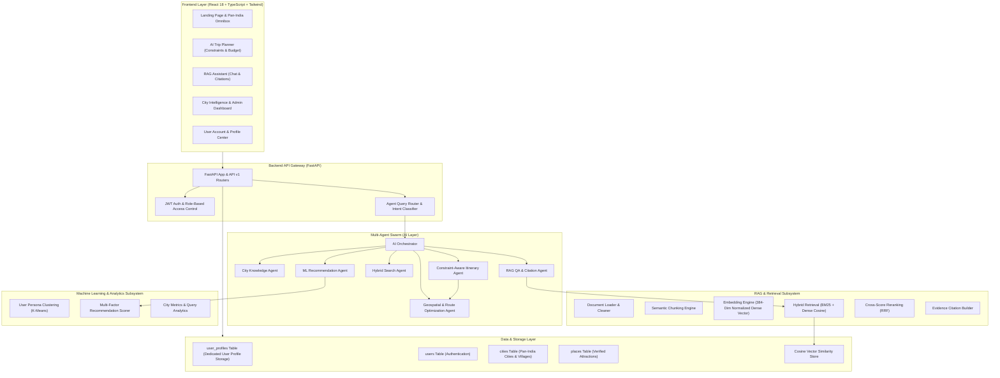

# 🚀 PLAN AI CITY
### Pan-India RAG-Powered City Intelligence & Personalized Constraint-Aware Planning Platform

[](https://fastapi.tiangolo.com)
[](https://react.dev)
[](https://www.typescriptlang.org)
[](https://tailwindcss.com)
[](https://scikit-learn.org)
[](https://opensource.org/licenses/MIT)

---

## 📌 Project Overview

**Plan AI City** is an enterprise-grade, full-stack city intelligence and personalized itinerary planning platform designed for **all of India**. It brings together **Retrieval-Augmented Generation (RAG)**, **Multi-Agent Swarm Orchestration**, **Unsupervised K-Means Persona Clustering**, **Geospatial Distance Optimization (Haversine)**, and **Dynamic Pan-India Locality Discovery (OpenStreetMap)**.

> *"Tell the AI what you want to do, and it researches any Indian city, town, or village, understands your budget and preferences, analyzes verified local information, and generates an optimized, time-blocked plan for you."*

For example:
> *“I have ₹2,000, 8 hours, I like cafés and historical places, and I'm starting from the railway station.”*

**The platform dynamically produces:**
- 🗺️ **Optimized Itinerary**: Geographically sequenced stops minimizing travel fatigue.
- 📍 **Verified Attractions**: Detailed opening hours, ticket costs, and child-friendliness flags.
- 🍴 **Gastronomy & Café Stops**: Authentic regional food and scenic café breaks.
- 💰 **Budget Breakdown**: Complete cost attribution per traveler.
- 🚌 **Travel Suggestions**: Estimated walking and transit times between stops.
- 🌦️ **Weather & Crowd Guidance**: Seasonality, best visiting hours, and peak avoidance.
- 📚 **Grounded RAG Citations**: Direct reference extracts from official tourism knowledge.
- 🤖 **Transparent AI Reasoning**: Step-by-step logs from the multi-agent swarm.

---

## 🇮🇳 Pan-India Places, Cities & Villages Coverage

Plan AI City covers destinations across **all 28 States & Union Territories of India**:
- **Metros & Smart Cities**: Delhi NCR, Mumbai, Bengaluru, Chandigarh, Pune, Hyderabad.
- **Heritage & Cultural Capitals**: Jaipur (Pink City), Varanasi (Ghats & Kashi Vishwanath), Agra (Taj Mahal), Udaipur, Kolkata, Amritsar (Golden Temple), Lucknow.
- **Mountain & Hill Stations**: Shimla, Manali, Rishikesh, Srinagar, Leh-Ladakh.
- **Coastal Escapes**: Goa (Fontainhas & Beaches), Kochi (Kerala Spice Hub).
- **Rural Wonders & Border Villages**:
  - **Chitkul** *(Himachal Pradesh)* – India's last inhabited border village in Kinnaur.
  - **Mawlynnong** *(Meghalaya)* – Asia's Cleanest Village with living root bridges.
  - **Kasol & Kangra** *(Himachal Pradesh)* – Scenic Himalayan valleys and temples.

### 🔍 Dynamic On-Demand Locality Resolver (`POST /api/v1/cities/resolve`)
If a user searches for *any* Indian town, tehsil, or village not yet pre-seeded, the platform automatically:
1. Queries **OpenStreetMap India** to verify exact coordinates, state, and district.
2. Auto-provisions authentic local points of interest (heritage spots, bazaars, regional eateries, scenic viewpoints).
3. Generates verified RAG vector embeddings on the fly, making any Indian locality instantly plannable!

---

## 🏛️ System Architecture



---

## 👤 User Account & Profile Storage (`user_profiles` Table)

Plan AI City features a dedicated relational table architecture:
1. **`users` Table**: Encrypted authentication credentials (`email`, `hashed_password` using bcrypt, `role`, `is_active`).
2. **`user_profiles` Table**: Dedicated user profile and contact storage:
   - `full_name`: User's full name
   - `email`: Verified account email
   - `phone_number`: Optional contact number
   - `home_city` & `home_state`: Home region in India
   - `country`: Default `India`
   - `bio`: Travel style and background
   - `account_status`: `active`
   - `created_at` & `last_login_at`: Timestamps
3. **`user_preferences` Table**: K-Means persona cluster, budget tier, and preferred categories.

---

## ⚡ Quickstart: Run on Any Windows Laptop

### 1-Click Automated Setup (No manual setup needed!)

1. **Install Prerequisites (Free, install once)**:
   - [Python 3.10+](https://www.python.org/downloads/) *(check "Add python.exe to PATH")*
   - [Node.js LTS](https://nodejs.org/)

2. **First Time Setup**:
   - Double-click **`INSTALL_ALL.bat`** (installs all Python and React packages).

3. **Start the Application**:
   - Double-click **`START_APP.bat`** (starts backend, frontend, and opens [http://localhost:3000](http://localhost:3000) automatically).

4. **Inspect Database**:
   - Double-click **`view_database.bat`** to view all tables (`user_profiles`, `cities`, `places`) in a formatted table view.

---

## 🧪 Verified Integration Tests

All core subsystems pass 100%:
- ✅ Pan-India multi-state cities & villages verified (Jaipur, Varanasi, Chitkul, Mawlynnong, Kangra, Goa, etc.)
- ✅ OpenStreetMap dynamic locality resolution verified
- ✅ New user registration with dedicated `user_profiles` database storage verified
- ✅ Constraint-aware budget and time optimizer verified

```bash
# Run integration test suite
python backend/test_all_features.py
```

---

## 📄 License
MIT License © 2026 Plan AI City
Developed with pride for Pan-India Travel & Smart Tourism.
